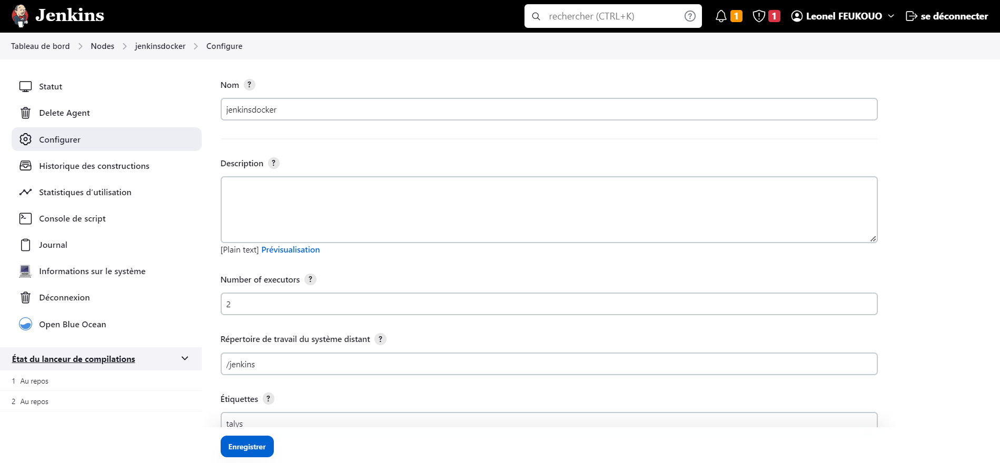

# **Gestion_java**

A Java Project For Talys InternShip in DevOps

## **1. ANALYSE DES EXIGENCES**

Dans cette phase initiale du projet, l'objectif est d'analyser les exigences du projet en termes d'intégration continue (CI). Les activités clés réalisées au cours de cette étape sont les suivantes :

### **a. Evaluation des besoins du projet en terme de CI**

L'évaluation des besoins du projet en termes d'intégration continue nous permet de comprendre les défis actuels et les opportunités d'amélioration. Les principales conclusions de cette évaluation sont les suivantes :

- **Les builds :**

    Ils jouent un rôle clé dans le processus d'intégration continue (CI), car ils permettent de compiler le code source, de l'intégrer avec d'autres composants et de générer une version exécutable du logiciel.

- **Les tests :**

    Ils jouent un rôle crucial dans le processus d'intégration continue (CI), car ils permettent de vérifier la qualité et la fonctionnalité du code à chaque étape du développement. Ils sont parfois réalisés de manière ad hoc (de manière improvisée, sans suivi ou sans structure préétablie), ce qui entraîne des retards dans la détection des problèmes et une augmentation du nombre de bugs en production. Nous souhaitons donc automatiser les tests afin d'améliorer la qualité du logiciel et de réduire les délais de mise sur le marché.

- **Les deploiements :**

    Ils font partie intégrante du processus d'intégration continue. Ils sont souvent effectués manuellement et prennent beaucoup de temps et sont sujets à des erreurs humaines.

### **b. Identification des outils et technologies necessaire**

Une recherche approfondie a été effectuée pour identifier les outils et les technologies nécessaires à la mise en place de l'intégration continue. Les critères suivants ont été pris en compte lors de la sélection des outils :

- **Facilité d'utilisation et de configuration**
- **Compatibilité avec les technologies existantes utilisées dans le projet, telles que Git pour le contrôle de version**
- **Fonctionnalités offertes, telles que des tests automatisés, un déploiement continu, une intégration avec des plateformes de gestion de projet, etc...**

Après avoir examiné différentes options, les outils suivants ont été choisis :

- **Jenkins :**

    Pour l'automatisation des builds, des tests et du déploiement.

- **SonarQube :**

    Pour l'analyse statique du code et l'assurance de la qualité.

- **Nexus :**

    Pour le deploiement des artefacts de build.

- **Docker :**

    Pour la création d'environnements de développement et de déploiement isolés.

- **Kubernetes :**

    Pour l'orchestration de notre application conteneurisée

- **ArgoCD :**

    Pour le deploiement continu de notre application sur Kubernetes

- **Maven :**

    Pour le build du code source de l’application

- **Tomcat :**

    Pour l’exécution de l’application web

### **c. Definition des objectifs et des criteres de succes**

Sur la base de l'évaluation des besoins, les objectifs suivants ont été définis pour l'intégration continue :

- **Réduction du temps de déploiement de 50% en automatisant les processus de build et de déploiement.**
- **Amélioration de la qualité du logiciel en augmentant la couverture des tests automatisés à 80%.**
- **Réduction des erreurs humaines liées aux déploiements manuels à zéro**

Les critères de succès pour évaluer si ces objectifs sont atteints sont les suivants :

- **Temps de déploiement moyen réduit à moins de 30 minutes.**
- **Taux de réussite des builds et des déploiements automatisés supérieur à 95%.**
- **Couverture des tests automatisés atteignant 80% dans les rapports de qualité.**
- **Aucune erreur critique liée aux déploiements manuels signalée pendant une période de 1 mois.**

&nbsp;

En conclusion de cette phase d'analyse des exigences, nous avons acquis une compréhension approfondie des besoins spécifiques du projet en termes d'intégration continue. Les outils et les technologies appropriés ont été identifiés, et des objectifs clairs avec des critères de succès ont été définis pour guider le reste du projet.

&nbsp;

## **2. INSTALLATION DE JENKINS**

L'étape d'installation de Jenkins est essentielle pour la mise en place de notre infrastructure de développement et d'intégration continue. Cette section présente les activités réalisées et les décisions prises lors de cette étape.

### **a. Préparation de l'environnement**

Avant d'installer Jenkins, nous avons vérifié les prérequis système pour nous assurer que le serveur sur lequel Jenkins sera installé répond aux exigences matérielles et logicielles. Cela inclut la vérification des dépendances Java, la disponibilité des ressources nécessaires et la configuration du système d'exploitation.

#### Configuration matérielle minimale requise

- 256 Mo de RAM
- 1 Go d'espace disque (un minimum de 10 Go est toutefois recommandé si Jenkins est exécuté en tant que conteneur Docker)

#### Configuration matérielle recommandée

- 4 Go+ de RAM
- 50 GB+ d'espace disque

#### Exigences logicielles

- **Java :**

        sudo apt-get install -y openjdk-11-jdk

Nous n'avons pas besoin de Java lorsque nous installons Jenkins a partir d'un conteneur.

### **b. Téléchargement et installation de Jenkins dans docker**

Nous avons téléchargé la dernière version stable de Jenkins à partir du [site officiel](https://www.jenkins.io). En suivant les [instructions d'installation fournies sur le site officiel](https://www.jenkins.io/doc/book/installing/docker/), nous avons procédé à l'installation de Jenkins sur le serveur désigné.

### **c. Configuration initiale**

Après l'installation, nous avons effectué la configuration initiale de Jenkins pour le mettre en fonctionnement. Cela inclut la définition du port d'écoute, la configuration des paramètres de sécurité de base et la création d'un compte administrateur pour accéder à l'interface utilisateur de Jenkins.

### **d. Tests de l'installation**

Pour confirmer que Jenkins est correctement installé, nous avons accédé à l'interface utilisateur via un navigateur web et vérifié sa disponibilité. Nous avons vérifié les fonctionnalités de base, telles que la création d'un projet de test simple et l'exécution d'un build pour nous assurer que Jenkins fonctionne comme prévu.

### **e. Configuration avancée**

Pour étendre les fonctionnalités de Jenkins, nous avons installé les plugins nécessaires à notre flux de travail DevOps. Cela inclut les plugins pour l'intégration avec Git, Docker, Maven et d'autres outils pertinents tels que SonarQube. Nous avons utilisé le gestionnaire de plugins de Jenkins pour rechercher, installer et configurer les plugins requis.
En plus de la configuration initiale, nous avons exploré les options de configuration avancée offertes par Jenkins. Cela comprend la personnalisation de l'environnement en fonction de nos besoins spécifiques, tels que la configuration des outils supplémentaires et des paramètres globaux.

#### Configuration de Maven dans Jenkins

#### Configuration de SonarQube dans Jenkins

Tout d’abord, nous devons installer le plugin nécessaire (SonarQube Scanner) comme suit :

Ensuite, créer un credential, pour permettre la communication entre Jenkins et le conteneur SonarQube à l’adresse <http://51.91.204.154:9001/> :

Une fois le credential créé, nous devons configurer SonarQube dans Jenkins comme suit :

#### Configuration de Nexus dans Jenkins

Tout d’abord, nous devons installer le plugin nécessaire (Nexus Artifact Uploader) comme suit :

Ensuite, créer un credential, pour permettre la communication entre Jenkins et le conteneur Nexus à l’adresse <http://51.91.204.154:8082/> :

Une fois le credential créé, nous devons configurer Nexus dans Jenkins comme suit :

#### Configuration de Docker Hub

Nous avons aussi besoin de créer un credential, pour permettre à Jenkins de se connecter à notre repository Docker Hub, pour sauvegarder les images créer par les builds.

**Installation de Docker :**

        sudo apt-get install -y ca-certificates curl gnupg
        sudo install -m 0755 -d /etc/apt/keyrings
        curl -fsSL https://download.docker.com/linux/debian/gpg |     sudo gpg --dearmor -o /etc/apt/keyrings/docker.gpg
        sudo chmod a+r /etc/apt/keyrings/docker.gpg
        echo \
            "deb [arch="$(dpkg --print-architecture)" signed-by=/etc/apt/keyrings/docker.gpg] https://download.docker.com/linux/debian \
            "$(. /etc/os-release && echo "$VERSION_CODENAME")" stable" | \
            sudo tee /etc/apt/sources.list.d/docker.list > /dev/null
        sudo apt-get update
        sudo apt-get install -y docker-ce docker-ce-cli containerd.io docker-buildx-plugin docker-compose-plugin

Veillez a ajouter votre utilisateur au groupe docker:

        sudo usermod -aG docker NOM_DE_VOTRE_USER

**Installation de Kubernetes :**

Suivre les etapes d'installation du [site officiel](https://kubernetes.io/docs/home/)

**Installation de ArgoCD :**

En résumé, l'étape d'installation de Jenkins, ainsi que d'autre outils a été réalisée avec succès. Jenkins est désormais prêt à être utilisé pour les prochaines étapes de notre projet DevOps.

&nbsp;

## **3. CONFIGURATION DU REFERENTIEL DE CODE SOURCE**

L'étape de configuration du référentiel de code source est essentielle pour intégrer le flux de travail de développement dans notre processus d'intégration continue. Cette section met en évidence les activités réalisées et les décisions prises lors de cette étape.

Avant de configurer Jenkins pour se connecter à notre référentiel GitHub, nous avons créé le référentiel sur GitHub en utilisant l'interface web GitHub.

### **a. Création du référentiel GitHub**

Nous avons créé un nouveau référentiel (ou repertoire) sur [GitHub](https://github.com) en spécifiant les détails tels que le nom du référentiel, la description et les options de visibilité. Par exemple, nous avons utilisé l'interface web GitHub pour créer un nouveau référentiel avec les paramètres suivants :

- Nom du référentiel : **Gestion_java**
- Description : **A Java Project For Talys InternShip in DevOps**
- Visibilité : **public**

Vous pouvez trouver le referentiel [ici](https://github.com/LeonelFeukouo/Gestion_java).

### **b. Ajout du référentiel GitHub a Jenkins**

Après avoir créé le référentiel sur GitHub, nous avons configuré Jenkins pour se connecter à notre référentiel en utilisant les étapes de pipeline appropriées.
Cela permet à Jenkins de récupérer le code source lors des opérations de build et de déploiement.

Par exemple :

    pipeline {
        agent any
        stages {
            stage('Clone') {
                steps {
                    git branch:'main', url:'https://github.com/LeonelFeukouo/Gestion_java.git'
                }
            }
        }
    }

### **c. Vérification de l'accès au référentiel**

Une fois que nous avons configuré le référentiel GitHub dans Jenkins, nous avons vérifié que Jenkins peut accéder avec succès au référentiel GitHub en déclenchant un job de test de récupération du code. Cela permet de s'assurer que Jenkins peut récupérer le code source depuis GitHub sans problème.

Execution du test d'acces au referentiel :

En effectuant ces étapes, nous avons réussi à configurer avec succès le référentiel GitHub dans Jenkins, à vérifier l'accès au référentiel pour garantir la recuperation en tout temps du code source et le bon fonctionnement de notre processus d'intégration continue.

&nbsp;

## **4. CONFIGURATION DU PROJET JENKINS**

L'étape de configuration du projet Jenkins est cruciale pour définir l'environnement d'intégration continue pour notre application. Cette section met en évidence les activités réalisées et les décisions prises lors de cette étape.

### **a. Création d'un nouveau projet Jenkins pour l'application**

Nous avons créé un nouveau projet Jenkins dédié à notre application. Pour cela, nous avons utilisé l'interface Jenkins pour créer un nouveau projet de type Pipeline, selon les besoins de notre projet, et nous l'avons nommé **Projet_De_Stage_Talys**

### **b. Configuration des paramètres généraux du projet**

- **Description du projet :** Nous avons ajouté une description pour décrire brièvement le projet et son objectif.

- **Paramètres du projet :** Ce projet contient des paramètres, mais nous les inclurons directement dans les script pipeline, pour permetre une reutilisation de ce script dans d'autres projet à l'avenir.

- **Déclencheurs du projet :** Comme declencheur, nous avons specifié que notre projet se déclenchera apres chaque modification de code source sur le repository GitHub. Pour cela, nous avons configuré un webhook sur GitHub, pour informer Jenkins après chaque modification.

Et nous l'avons activé dans Jenkins comme suit:

- **Definition du Projet :**

En effectuant ces étapes, nous avons réussi à configurer avec succès le projet Jenkins pour notre application, en veillant à ce qu'il soit bien adapté à notre processus d'intégration continue et aux besoins spécifiques de notre projet.

&nbsp;

## **5. CREATION DU PIPELINE JENKINS**

L'étape de création du pipeline Jenkins est essentielle pour définir un processus d'intégration et de déploiement continu (CI/CD) pour notre application. Cette section met en évidence les activités réalisées et les décisions prises lors de cette étape.

### **a. Élaboration du pipeline CI/CD en utilisant le langage de script Jenkins**

Nous avons créé un pipeline Jenkins en utilisant le langage de script Jenkins (Pipeline DSL) pour définir notre processus CI/CD. Le pipeline décrit les étapes et les actions à effectuer, depuis la récupération du code source jusqu'au déploiement de l'application.

Le pipeline suivant utilise le langage de script Jenkins, et defini quelques grandes etapes qui sont utilisées dans notre pipeline :

    pipeline {
        agent any
        
        stages {
            stage('Checkout') {
                steps {
                    echo "Récupération du code source depuis le référentiel"
                }
            }
            
            stage('Build') {
                steps {
                    echo "Construction de l'application avec Maven"
                }
            }
            
            stage('Test') {
                steps {
                    echo "Exécution des tests automatisés"
                }
            }
            
            stage('Deploy') {
                steps {
                    echo "Déploiement de l'application sur un serveur ou un conteneur"
                }
            }
        }
    }

### **b. Définition des différentes étapes de build, de test et de déploiement dans le pipeline**

Dans notre pipeline, nous avons défini plusieurs étapes pour notre processus CI/CD :

- **Checkout :** Cette étape récupère le code source à partir du référentiel de code source configuré précédemment (GITHUB).
- **Build :** Cette étape compile l'application en utilisant Maven.
- **Test :** Cette étape exécute les tests automatisés pour vérifier la qualité du code, a l'aide de SonarQube.
- **Deploy :** Cette étape déploie l'application sur un serveur ou un conteneur, dans cet exemple, nous avons tout d'abord deployé l'artefact créé a l'aide de Maven sur NEXUS, puis nous avons utilisé Docker pour construire l'image de l'application et la déployer dans un conteneur.

Ces étapes sont les plus importantes de notre pipeline que nous verrons par la suite.

&nbsp;

## **6. CONFIGURATION DES BUILDS**

L'étape de configuration des builds est cruciale pour garantir que notre pipeline Jenkins peut compiler et construire notre application avec succès. Cette section met en évidence les activités réalisées et les décisions prises lors de cette étape.

### **a. Configuration des outils de build dans le pipeline Jenkins**

Dans cette étape, nous avons configuré l'outil de build nécessaires (Maven) dans le pipeline Jenkins. Cela garantit que Jenkins dispose de l'outil appropriés pour construire l'application selon les besoins spécifiques du projet.

La configuration de Maven dans notre pipeline Jenkins est la suivante, en fonction de l'etape [2.e](#e-configuration-avancée) ou nous avons configuree Maven sous le nom **maven** :

    tools {
        maven 'maven'
    }

### **b. Spécification des paramètres de build, tels que les options de compilation, les variables d'environnement, etc**

Dans notre pipeline, nous n'avons pas véritablement utilisé d'option de compilation ou encore de variables d'environnement. Nous avons utilisé les parametres par defaut pour la compilation comme suit:

    stage('BUILD avec Maven') {
        steps {
            sh 'mvn clean package'
        }
    }

En effectuant ces étapes, nous avons réussi à configurer avec succès l'outil de build, garantissant ainsi que notre application peut être compilée et construite correctement à chaque exécution du pipeline.

&nbsp;

## **7. CONFIGURATION DES TESTS AUTOMATISES**

L'étape de configuration des tests automatisés est cruciale pour garantir la qualité et la fiabilité de notre application. Dans cette section, nous mettrons en évidence les activités réalisées pour intégrer des frameworks de tests, comme SonarQube, dans le pipeline Jenkins.

### **a. Intégration de SonarQube dans le pipeline Jenkins**

SonarQube est un outil puissant pour l'analyse statique du code, l'inspection de la qualité du code et la détection de problèmes de sécurité. Intégrer SonarQube dans notre pipeline Jenkins nous permet d'obtenir des informations détaillées sur la qualité du code et de détecter les problèmes potentiels avant le déploiement.

Son integration dans notre pipeline est le suivant, en fonction de l'etape [2.e](#e-configuration-avancée) ou nous avons configuree SonarQube sous le nom **sq1** :

    stage('TEST avec Sonarqube') {
        steps {
            withSonarQubeEnv('sq1') { 
                sh 'mvn org.sonarsource.scanner.maven:sonar-maven-plugin:3.9.0.2155:sonar'
            }
        }
    }

### **b. Analyse des résultats de SonarQube**

Après l'exécution de l'analyse de code avec SonarQube, les résultats seront disponibles sur le serveur SonarQube configuré a l'etape [2.e](#e-configuration-avancée). Ces résultats incluent des informations détaillées sur la qualité du code, les problèmes de code, les vulnérabilités de sécurité, les duplications de code, etc. Nous pourrons consulter les rapports générés par SonarQube pour prendre des mesures d'amélioration de la qualité du code.

Resultats du test:

Details des bugs obtenu lors du test:

En effectuant ces étapes, nous avons réussi à intégrer SonarQube dans notre pipeline Jenkins pour effectuer des analyses de code automatisées et obtenir des informations détaillées sur la qualité de notre application.

&nbsp;

## **8. CONFIGURATION DU DEPLOIEMENT**

L'étape de configuration du déploiement est cruciale pour automatiser le processus de déploiement de notre application. Dans cette section, nous mettrons en évidence les activités réalisées pour configurer les étapes de déploiement dans le pipeline Jenkins et intégrer des outils de déploiement tel que Nexus, Docker et Kubernetes.

### **a. Ajout d’une machine de déploiement sur Docker dans les paramètres de Jenkins**

Pour permettre à Jenkins d'effectuer des opérations de déploiement sur une machine distante, nous devons configurer les paramètres de Jenkins pour qu'il puisse accéder à cette machine en toute sécurité. Cette étape implique l'ajout d'une machine de déploiement dans les paramètres de Jenkins.

Voici quelques images qui montrent comment cela peut être réalisé :

Ici, notre machine s’appelle jenkinsdocker, mais nous utiliserons son label (talys) dans notre pipeline pour faire allusion à elle.

### **b. Configuration des étapes de déploiement dans le pipeline Jenkins**

Dans notre pipeline Jenkins, nous avons défini les étapes de déploiement spécifiques pour notre application, et certaines utilisent SSH pour accéder aux serveurs de déploiement pour exécuter des commandes d’arrêt et de démarrage des conteneurs Docker contenant l'application. Ces étapes peuvent varier en fonction des besoins du projet, du type d'application et de l'infrastructure cible.

Dans notre cas, nous avons :

#### i. Spécification de la machine cible et des variables à utiliser

Nous spécifions ici, la machine qui sera utilisée pour le déploiement, avec l’option **agent**, ainsi que les variables d’environnement à utiliser lors du déploiement avec l’option **environment**.

Le paramètre **BUILD_NUMBER** est défini par défaut dans Jenkins, et est incrémenté à chaque exécution du pipeline, et le paramètre **DOCKERHUB_CREDENTIALS** a été défini plus haut dans ce rapport.

#### ii. Déploiement sur Nexus

Cette étape défini le script nécessaire au déploiement notre artefact compilé sur Nexus ; L’illustration de ce déploiement se fait comme suit :

#### iii. Création de l’image Docker

Cette étape défini le script nécessaire à la création d’une image docker (à l’aide de la commande docker build) qui sera utilisé pour lancer nos conteneurs Docker et Kubernetes.

Cette étape utilise le fichier Dockerfile définit comme suit :

Ce fichier se charge de copier notre artefact, vers l’emplacement adéquate, afin que Tomcat puisse le lire et le mettre à disposition de l’utilisateur finale.

#### iiii. Déploiement de l’image sur DockerHub

Cette étape défini le script nécessaire au déploiement de notre image sur le référentiel **Docker Hub** (à l’aide des commande Docker) ; **DOCKERHUB_CREDENTIALS_PSW** et **DOCKERHUB_CREDENTIALS_USR** ont été défini lors de la définition du paramètre **DOCKERHUB_CREDENTIALS** plus haut.

#### iiiii. Déploiement de l’application avec ArgoCD et Kubernetes

Une fois l’image publiée su DockerHub, cette étape se lance pour mettre à jour l’image Docker dans le référentiel secondaire, pour que ArgoCD puisse le récupérer automatiquement, et mettre à jour notre application dans le cluster Kubernetes ;

**NB** : La section **git push** utilise le token que nous avons configuré sur GitHub.

Mais avant que ArgoCD ne puisse faire les mises à jour automatiquement, nous devons créer un nouveau projet dans son interface, en spécifiant les paramètres contenus dans le fichier suivant :

C’est le fichier principal de création des applications Kubernetes avec ArgoCD. Il contient les informations nécessaires sur le repository distant, le cluster dans lequel l’application doit être déployée, ainsi que d’autres informations nécessaires à l’exécution de l’application.

Pour exécuter ce fichier dans ArgoCD, il faut s’assurer que ArgoCD est déjà installée dans le cluster Kubernetes et exécuter la commande suivante :

    kubectl apply -f application.yaml

Lors de l’exécution de ce fichier, ArgoCD fera appel (dans notre cas) a deux autres fichiers situe dans le répertoire dev (comme mentionné dans le fichier principal précèdent) sur GitHub. Ces fichiers sont les suivants :

Ce premier fichier est le fichier utilisé pour lancer notre application proprement dite dans le cluster Kubernetes. Il contient le nom de l’image, que nous avons précédemment déployée sur DockerHub.

Ce second fichier est la configuration d’un service Kubernetes qui permettra d’accéder à notre application sur le port 8080.

Nous verrons les résultats du déploiement de l’application par la suite.

#### iiiiii. Déploiement de l’application avec un conteneur Docker

Cette étape défini le script nécessaire au lancement du conteneur docker sur la machine **jenkinsdocker** configurée plus haut ;

Ce script vérifie tout d’abord l’existence d’un conteneur lancé lors d’un précèdent déploiement. Si un tel conteneur existe, il le supprime avant de lancer le nouveau. Au cas contraire, il lance directement le conteneur.

### **c. Vérification des résultats obtenus après l’exécution complète du pipeline**

Apres l’exécution de notre pipeline, l’interface de Jenkins affiche l’image suivante, dans laquelle on peut voir que toutes les étapes ont été effectuées avec succès.

Le résultat du déploiement sur Nexus est le suivant, ou on peut constater que notre artefact a bien été uploadé.

Sur Docker Hub, on peut voir que notre image a été créé avec succès et déployée convenablement.

Avant l’exécution complète de notre chaine CI/CD, notre application Kubernetes utilise l’image **leonelfeukouo/talys_app:v_4**.

Son affichage dans ArgoCD se présente comme suit:

On remarque la présence d’un seul **replicaset**. Car, le fichier **application.yaml** n’a pas encore été modifié sur GitHub.

Après l’exécution complète de notre chaine CI/CD, notre application Kubernetes utilise maintenant l’image **leonelfeukouo/talys_app:v_5**, car Jenkins s’est chargé de la modification de la version d’image sur GitHub.

Son affichage dans ArgoCD se présente comme suit :

On remarque maintenant la présence de deux replicasets, l’ancien et le nouveau. Ce qui nous confirme que ArgoCD fonctionne normalement, et notre pipeline s’est bien exécuté.

Dans l’étape précédente, notre conteneur a été lancé sur le port 8080 dans le pipeline Jenkins, pour le fonctionnement de l’application sur Docker.

Pour le fonctionnement avec Kubernetes, le port 8080 a aussi été configuré pour les Pod et conteneurs, mais le service qui a été créé nous demande d’accéder à l’application sur le port 30800. Nous pouvons voir cela dans la configuration du service encours d’exécution.

On peut vérifier cela dans notre navigateur, pour voir si tout s’est exactement bien passé.

Les adresses IP suivantes nous donnent exactement les mêmes résultats.

- Fonctionnement sur Docker : <http://51.91.204.154:8080/>
- Fonctionnement sur Kubernetes : <http://51.91.204.153:30800/>

On peut constater que tout s’est passé comme prévu. Notre application fonctionne parfaitement.

En effectuant ces étapes, nous avons réussi à configurer avec succès les étapes de déploiement dans le pipeline Jenkins et à intégrer des outils de déploiement tels que Docker pour réaliser le déploiement automatisé de notre application.
