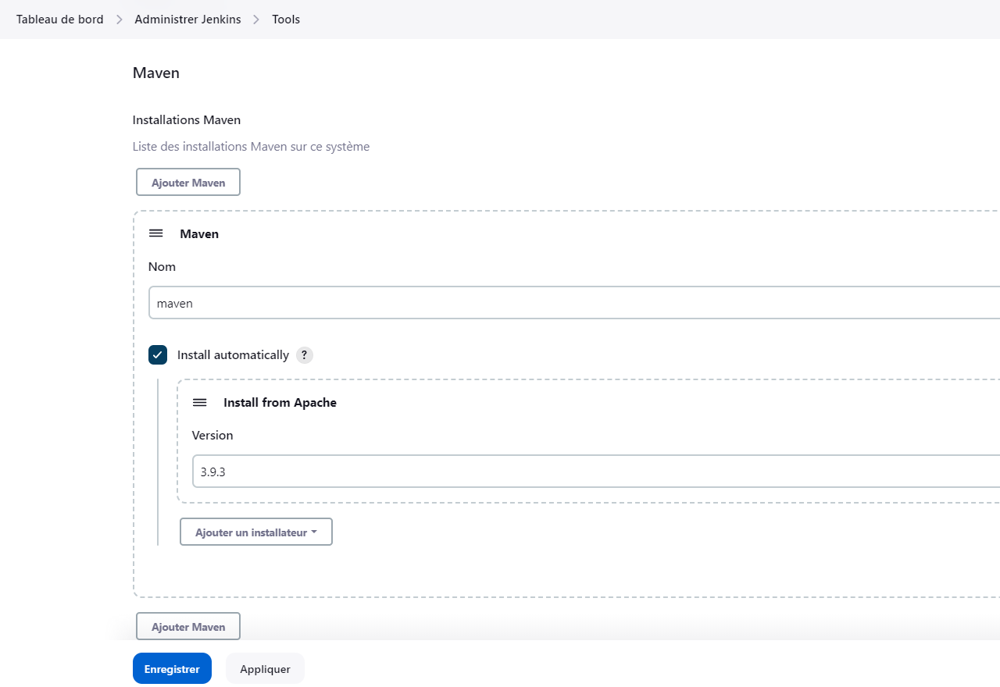

# **Gestion_java**

A Java Project For Talys InternShip in DevOps

## **1. ANALYSE DES EXIGENCES**

Dans cette phase initiale du projet, l'objectif est d'analyser les exigences du projet en termes d'intégration continue (CI). Les activités clés réalisées au cours de cette étape sont les suivantes :

### **a. Evaluation des besoins du projet en terme de CI**

L'évaluation des besoins du projet en termes d'intégration continue nous permet de comprendre les défis actuels et les opportunités d'amélioration. Les principales conclusions de cette évaluation sont les suivantes :

- **Les builds :**

    Ils jouent un rôle clé dans le processus d'intégration continue (CI), car ils permettent de compiler le code source, de l'intégrer avec d'autres composants et de générer une version exécutable du logiciel.

- **Les tests :**

    Ils jouent un rôle crucial dans le processus d'intégration continue (CI), car ils permettent de vérifier la qualité et la fonctionnalité du code à chaque étape du développement. Ils sont parfois réalisés de manière ad hoc (de manière improvisée, sans suivi ou sans structure préétablie), ce qui entraîne des retards dans la détection des problèmes et une augmentation du nombre de bugs en production. Nous souhaitons donc automatiser les tests afin d'améliorer la qualité du logiciel et de réduire les délais de mise sur le marché.

- **Les deploiements :**

    Ils font partie intégrante du processus d'intégration continue. Ils sont souvent effectués manuellement et prennent beaucoup de temps et sont sujets à des erreurs humaines.

### **b. Identification des outils et technologies necessaire**

Une recherche approfondie a été effectuée pour identifier les outils et les technologies nécessaires à la mise en place de l'intégration continue. Les critères suivants ont été pris en compte lors de la sélection des outils :

- **Facilité d'utilisation et de configuration**
- **Compatibilité avec les technologies existantes utilisées dans le projet, telles que Git pour le contrôle de version**
- **Fonctionnalités offertes, telles que des tests automatisés, un déploiement continu, une intégration avec des plateformes de gestion de projet, etc...**

Après avoir examiné différentes options, les outils suivants ont été choisis :

- **Jenkins :**

    Pour l'automatisation des builds, des tests et du déploiement.

- **SonarQube :**

    Pour l'analyse statique du code et l'assurance de la qualité.

- **Nexus :**

    Pour le deploiement des artefacts de build.

- **Docker :**

    Pour la création d'environnements de développement et de déploiement isolés.

- **Maven :**

    Pour le build du code source de l’application

- **Tomcat :**

    Pour l’exécution de l’application web

### **c. Definition des objectifs et des criteres de succes**

Sur la base de l'évaluation des besoins, les objectifs suivants ont été définis pour l'intégration continue :

- **Réduction du temps de déploiement de 50% en automatisant les processus de build et de déploiement.**
- **Amélioration de la qualité du logiciel en augmentant la couverture des tests automatisés à 80%.**
- **Réduction des erreurs humaines liées aux déploiements manuels à zéro**

Les critères de succès pour évaluer si ces objectifs sont atteints sont les suivants :

- **Temps de déploiement moyen réduit à moins de 30 minutes.**
- **Taux de réussite des builds et des déploiements automatisés supérieur à 95%.**
- **Couverture des tests automatisés atteignant 80% dans les rapports de qualité.**
- **Aucune erreur critique liée aux déploiements manuels signalée pendant une période de 1 mois.**

&nbsp;

En conclusion de cette phase d'analyse des exigences, nous avons acquis une compréhension approfondie des besoins spécifiques du projet en termes d'intégration continue. Les outils et les technologies appropriés ont été identifiés, et des objectifs clairs avec des critères de succès ont été définis pour guider le reste du projet.

&nbsp;

## **2. INSTALLATION DE JENKINS**

L'étape d'installation de Jenkins est essentielle pour la mise en place de notre infrastructure de développement et d'intégration continue. Cette section présente les activités réalisées et les décisions prises lors de cette étape.

### **a. Préparation de l'environnement**

Avant d'installer Jenkins, nous avons vérifié les prérequis système pour nous assurer que le serveur sur lequel Jenkins sera installé répond aux exigences matérielles et logicielles. Cela inclut la vérification des dépendances Java, la disponibilité des ressources nécessaires et la configuration du système d'exploitation.

#### Configuration matérielle minimale requise

- 256 Mo de RAM
- 1 Go d'espace disque (un minimum de 10 Go est toutefois recommandé si Jenkins est exécuté en tant que conteneur Docker)

#### Configuration matérielle recommandée

- 4 Go+ de RAM
- 50 GB+ d'espace disque

#### Exigences logicielles

- **Java :**

        sudo apt-get install -y openjdk-11-jdk

- **Docker :**

        sudo apt-get install -y ca-certificates curl gnupg
        sudo install -m 0755 -d /etc/apt/keyrings
        curl -fsSL https://download.docker.com/linux/debian/gpg |     sudo gpg --dearmor -o /etc/apt/keyrings/docker.gpg
        sudo chmod a+r /etc/apt/keyrings/docker.gpg
        echo \
            "deb [arch="$(dpkg --print-architecture)" signed-by=/etc/apt/keyrings/docker.gpg] https://download.docker.com/linux/debian \
            "$(. /etc/os-release && echo "$VERSION_CODENAME")" stable" | \
            sudo tee /etc/apt/sources.list.d/docker.list > /dev/null
        sudo apt-get update
        sudo apt-get install -y docker-ce docker-ce-cli containerd.io docker-buildx-plugin docker-compose-plugin

Veillez a ajouter votre utilisateur au groupe docker:

        sudo usermod -aG docker NOM_DE_VOTRE_USER

### **b. Téléchargement et installation de Jenkins dans docker**

Nous avons téléchargé la dernière version stable de Jenkins à partir du [site officiel](https://www.jenkins.io). En suivant les [instructions d'installation fournies sur le site officiel](https://www.jenkins.io/doc/book/installing/docker/), nous avons procédé à l'installation de Jenkins sur le serveur désigné.

### **c. Configuration initiale**

Après l'installation, nous avons effectué la configuration initiale de Jenkins pour le mettre en fonctionnement. Cela inclut la définition du port d'écoute, la configuration des paramètres de sécurité de base et la création d'un compte administrateur pour accéder à l'interface utilisateur de Jenkins.

### **d. Tests de l'installation**

Pour confirmer que Jenkins est correctement installé, nous avons accédé à l'interface utilisateur via un navigateur web et vérifié sa disponibilité. Nous avons vérifié les fonctionnalités de base, telles que la création d'un projet de test simple et l'exécution d'un build pour nous assurer que Jenkins fonctionne comme prévu.

### **e. Configuration avancée**

Pour étendre les fonctionnalités de Jenkins, nous avons installé les plugins nécessaires à notre flux de travail DevOps. Cela inclut les plugins pour l'intégration avec Git, Docker, Maven et d'autres outils pertinents tels que SonarQube. Nous avons utilisé le gestionnaire de plugins de Jenkins pour rechercher, installer et configurer les plugins requis.
En plus de la configuration initiale, nous avons exploré les options de configuration avancée offertes par Jenkins. Cela comprend la personnalisation de l'environnement en fonction de nos besoins spécifiques, tels que la configuration des outils supplémentaires et des paramètres globaux.

#### Configuration de Maven dans Jenkins

#### Configuration de SonarQube dans Jenkins

Tout d’abord, nous devons installer le plugin nécessaire (SonarQube Scanner) comme suit :

Ensuite, créer un credential, pour permettre la communication entre Jenkins et le conteneur SonarQube à l’adresse <http://51.91.204.154:9001/> :

Une fois le credential créé, nous devons configurer SonarQube dans Jenkins comme suit :

#### Configuration de Nexus dans Jenkins

Tout d’abord, nous devons installer le plugin nécessaire (Nexus Artifact Uploader) comme suit :

Ensuite, créer un credential, pour permettre la communication entre Jenkins et le conteneur Nexus à l’adresse <http://51.91.204.154:8082/> :

Une fois le credential créé, nous devons configurer Nexus dans Jenkins comme suit :

#### Configuration de Docker Hub

Nous avons aussi besoin de créer un credential, pour permettre à Jenkins de se connecter à notre repository Docker Hub, pour sauvegarder les images créer par les builds.

### **f. Intégration avec les outils externes**

Nous avons réalisé l'intégration de Jenkins avec d'autres outils utilisés dans notre pile DevOps. Cela comprend les outils de gestion des tests, les systèmes de gestion des versions et les outils de surveillance, parmi d'autres. L'intégration avec ces outils permet une automatisation plus complète et une meilleure visibilité des différentes phases du cycle de vie du développement. C’est le cas de SonarQube et de Nexus comme vu précédemment.

En résumé, l'étape d'installation de Jenkins a été réalisée avec succès. Jenkins est désormais prêt à être utilisé pour les prochaines étapes de notre projet DevOps.

&nbsp;

## **3. CONFIGURATION DU REFERENTIEL DE CODE SOURCE**

L'étape de configuration du référentiel de code source est essentielle pour intégrer le flux de travail de développement dans notre processus d'intégration continue. Cette section met en évidence les activités réalisées et les décisions prises lors de cette étape.

Avant de configurer Jenkins pour se connecter à notre référentiel GitHub, nous avons créé le référentiel sur GitHub en utilisant l'interface web GitHub.

### **a. Création du référentiel GitHub**

Nous avons créé un nouveau référentiel (ou repertoire) sur [GitHub](https://github.com) en spécifiant les détails tels que le nom du référentiel, la description et les options de visibilité. Par exemple, nous avons utilisé l'interface web GitHub pour créer un nouveau référentiel avec les paramètres suivants :

- Nom du référentiel : **Gestion_java**
- Description : **A Java Project For Talys InternShip in DevOps**
- Visibilité : **public**

Vous pouvez trouver le referentiel [ici](https://github.com/LeonelFeukouo/Gestion_java).

### **b. Ajout du référentiel GitHub a Jenkins**

Après avoir créé le référentiel sur GitHub, nous avons configuré Jenkins pour se connecter à notre référentiel en utilisant les étapes de pipeline appropriées.
Cela permet à Jenkins de récupérer le code source lors des opérations de build et de déploiement.

Par exemple :

    pipeline {
        agent any
        stages {
            stage('Clone') {
                steps {
                    git branch:'main', url:'https://github.com/LeonelFeukouo/Gestion_java.git'
                }
            }
        }
    }

### **c. Vérification de l'accès au référentiel**

Une fois que nous avons configuré le référentiel GitHub dans Jenkins, nous avons vérifié que Jenkins peut accéder avec succès au référentiel GitHub en déclenchant un job de test de récupération du code. Cela permet de s'assurer que Jenkins peut récupérer le code source depuis GitHub sans problème.

Execution du test d'acces au referentiel :

En effectuant ces étapes, nous avons réussi à configurer avec succès le référentiel GitHub dans Jenkins, à vérifier l'accès au référentiel pour garantir la recuperation en tout temps du code source et le bon fonctionnement de notre processus d'intégration continue.

&nbsp;

## **4. CONFIGURATION DU PROJET JENKINS**

L'étape de configuration du projet Jenkins est cruciale pour définir l'environnement d'intégration continue pour notre application. Cette section met en évidence les activités réalisées et les décisions prises lors de cette étape.

### **a. Création d'un nouveau projet Jenkins pour l'application**

Nous avons créé un nouveau projet Jenkins dédié à notre application. Pour cela, nous avons utilisé l'interface Jenkins pour créer un nouveau projet de type Pipeline, selon les besoins de notre projet, et nous l'avons nommé **Projet_De_Stage_Talys**

### **b. Configuration des paramètres généraux du projet**

- **Description du projet :** Nous avons ajouté une description pour décrire brièvement le projet et son objectif.

- **Paramètres du projet :** Ce projet contient des paramètres, mais nous les inclurons directement dans les script pipeline, pour permetre une reutilisation de ce script dans d'autres projet à l'avenir.

- **Déclencheurs du projet :** Comme declencheur, nous avons specifié que notre projet se déclenchera apres chaque modification de code source sur le repository GitHub. Pour cela, nous avons configuré un webhook sur GitHub, pour informer Jenkins après chaque modification.

Et nous l'avons activé dans Jenkins comme suit:

- **Definition du Projet :**

En effectuant ces étapes, nous avons réussi à configurer avec succès le projet Jenkins pour notre application, en veillant à ce qu'il soit bien adapté à notre processus d'intégration continue et aux besoins spécifiques de notre projet.

&nbsp;

## **5. CREATION DU PIPELINE JENKINS**

&nbsp;

## **6. CONFIGURATION DES BUILDS**

&nbsp;

## **7. CONFIGURATION DES TESTS AUTOMATISES**

&nbsp;

## **8. CONFIGURATION DU DEPLOIEMENT**

&nbsp;

## **9. CONFIGURATION DES NOTIFICATIONS**

&nbsp;

## **10. TESTS ET VALIDATION**
